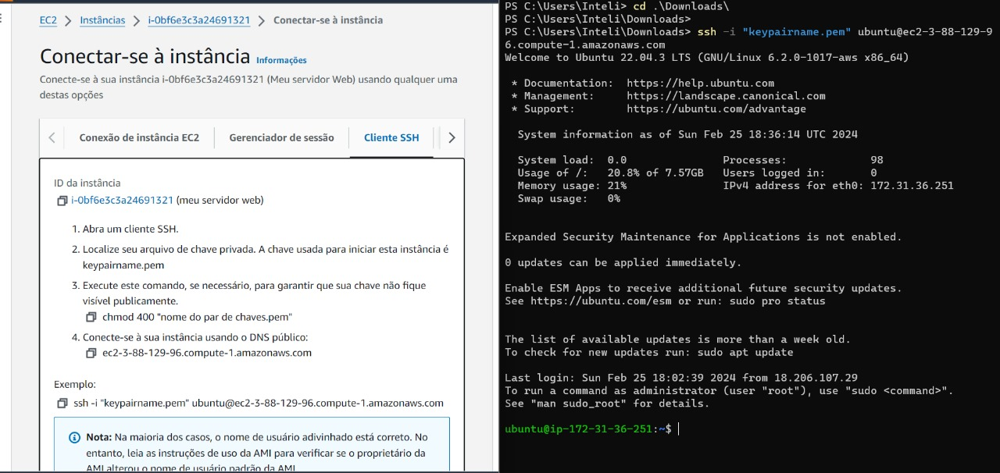

# ponderadaSemana3
# Relatório técnico - Acesso SSH no EC2.

### Introdução
Esse relatório foi desenvolvido com a visão de auxilia-lo no processo de criação de uma Instãncia EC2 na AWS e acessá-la por meio do SSH, utilizando o Openssh.

### Objetivo
O objetivo desse relatório é compartilhar algumas das etapas na criação de uma instância EC2 na AWS, conectando-a por meio do SSH (Openssh) e em seguida, documentando o processo de criação feito.

### Materiais
- Conta AWS
- Uso da Openssh para ter o acesso SSH
- Interface de acesso a linha de comando

### Métodos
Prints solicitados da criação:
- Console com a máquina criada

- SSH bem sucedido

- IP da máquina EC2 criada

### Resultados
Neste relatório, é apresentado com sucesso o passo a passo para criar uma instância do EC2 na AWS e acessá-la por meio do SSH utilizando o Openssh. O repositório no GitHub oferece um registro claro e bem organizado, contendo capturas de tela do console com a máquina criada na conta do usuário, comprovação do acesso SSH bem-sucedido e o endereço IP da instância do EC2. A documentação está estruturada através de commits distintos no GitHub, sendo preferencialmente realizados por meio da interface de linha de comando.

### Conclusão
A criação da instância EC2 foi concluída com sucesso. O usuário conseguiu realizar o acesso via SSH, inserindo corretamente os comandos por meio do SSH. Através deste relatório, foi possível realizar o acesso SSH na instância do Amazon Elastic Compute Cloud (EC2). O acesso SSH ao servidor EC2 foi realizado com sucesso, permitindo uma conexão segura e autenticada entre as instâncias do Amazon Web Services.